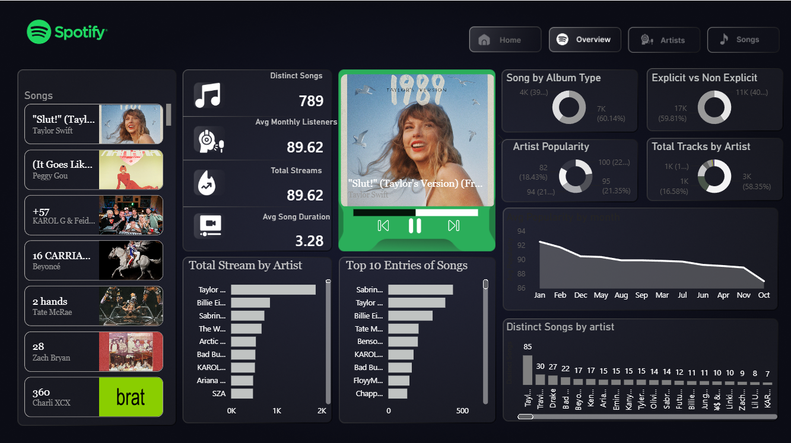

# Spotify Track Analysis & Power BI Dashboard

## 📌 Project Overview

This project analyzes Spotify track data using **Python**, **Pandas**, **NumPy**, **Matplotlib**, **Seaborn**, and **Power BI** to uncover insights into music popularity, streaming performance, artists, genres, and listener engagement.

The project combines **Exploratory Data Analysis (EDA)** with an interactive **Power BI dashboard** to present key trends and relationships within the dataset.

---

## 📂 Project Structure

```text
Spotify-Track-Analysis/
│
├── ANALYSIS_spotify.ipynb
├── Spotify_PowerBI_Dashboard.pbix
├── spotify_enhanced.csv
└── README.md
```

---

## 🛠 Technologies & Libraries Used

* Python
* Pandas
* NumPy
* Matplotlib
* Seaborn
* Plotly
* Power BI
* Jupyter Notebook

---

## 💡 Key Insights

Some important observations from the analysis include:

* A small number of artists account for a significant share of total streams.
* Higher monthly listeners generally correspond to greater streaming numbers.
* Music popularity varies considerably across different genres.
* Strong relationships exist between several audio features, as shown in the correlation heatmap.
* Streaming performance differs across countries.
* Interactive visualizations help identify trends that are difficult to observe in static charts.

---

## 📸 Dashboard Preview



## ▶️ Getting Started

### 1. Clone the Repository

```bash
git clone https://github.com/ShivangSingh72/Spotify-Track-Analysis.git
```

### 2. Install Dependencies

```bash
pip install pandas numpy matplotlib seaborn plotly
```

### 3. Launch Jupyter Notebook

```bash
jupyter notebook
```

### 4. Open and Run

* `ANALYSIS_spotify.ipynb`

### 5. View Dashboard

Open the Power BI dashboard file:

```text
Spotify_PowerBI_Dashboard.pbix
```

using **Microsoft Power BI Desktop**.

---

## 🚀 Future Enhancements

Potential improvements include:

* Deploy an interactive dashboard using Power BI Service
* Build a Streamlit web application
* Predict track popularity using Machine Learning
* Perform sentiment analysis using song lyrics
* Analyze trends over release years
* Integrate Spotify Web API for live data

---

## 👨‍💻 Author

**Shivang Singh**

**B.Tech – Artificial Intelligence & Machine Learning**

Currently Learning:

* Python
* NumPy
* Pandas
* Matplotlib
* Seaborn
* Power BI
* Machine Learning

---

⭐ If you found this project useful, consider giving the repository a star!
